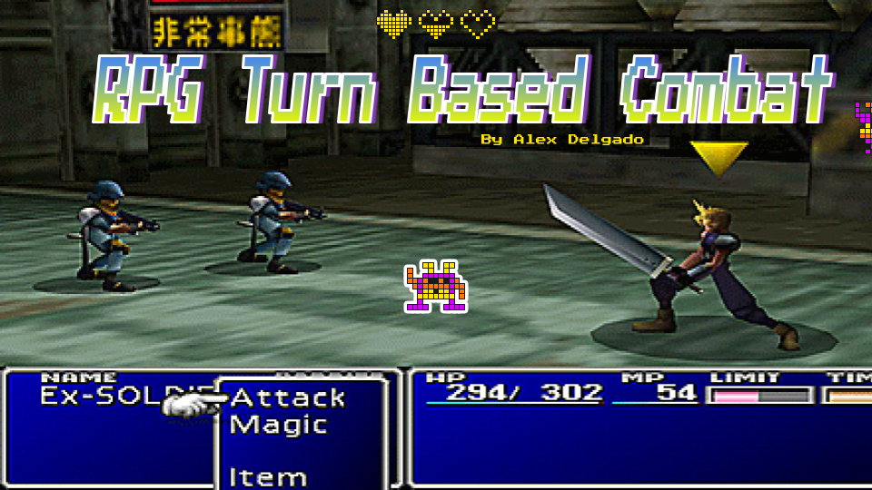

<!-- PROJECT LOGO -->
 

  
  
  

  

  
  ## Information
  
  - Slides [link](https://docs.google.com/presentation/d/1T1qyuFi4za6LLOvU8lZpIZIiuwmVqxQeyNQeSB-ndmQ/edit?usp=sharing)
  
  - Github [Project Link](https://github.com/faelion/RPG-Turn-Based-Combat)
  
  - UPC CITM - [Videogame Design & Development (English)](https://www.citm.upc.edu/cat/estudis/grau-videojocs-bcn/)

  
Index

  <ol>
    <li>
      <a href="#Introduction">Introduction</a>
    </li>
    <li>
      <a href="#Types_of_Turn-Based_Combat">Types of Turn-Based Combat</a>
    </li>
    <li>
      <a href="#Elements_of_Turn-Based_Combat">Elements of Turn-Based Combat</a>
    </li>
    <li>
      <a href="#Conclusion">Conclusion</a>
    </li>
  </ol>

## Introduction
Today's discussion will focus on the mechanics of turn-based RPG combat. We will explore different types of turn-based RPGs, the basic elements that compose this type of combat, and how to design and develop a turn-based combat system.

## Types_of_Turn-Based_Combat

In the history of turn-based RPGs, there are two main types of combat that remain until today and have standardized the genre: Classic turn-based and Strategic/tactical combat.

### Classic turn-based
Classic turn-based combat is seen in games like the majority of the Final Fantasy saga, Earthbound, Pokemon, Paper Mario, or more recent ones like Octopath Traveler, Bravely Default, Persona saga, and Darkest Dungeon. This type of combat is characterized by having pauses and let the player choose each of their actions taking into account the causes and consequences at all times, as opposed to games that develop in real time and the mechanical skill of the player also comes into play, leaving aside the strategic component in many cases. The gameplay is based on turn management, allies and strategy when combining different elements or attack/defense sequences. Because of this, most games with this system fall back on a slow combat that can become tedious.

 

### Strategy/Tactic
On the other hand, strategic or tactical combat is seen in games like the Fire Emblem saga, Final Fantasy Tactics, Advance Wars, and more recent ones like XCOM, Triangle Strategy, Wakfu, Mario & Rabbids, Pit People, and SteamWorld: Heist. Strategic combat adds a layer of complexity to turn-based combat, as units will now be controlled on a grid system, which allows for more attack and defense mechanics based on positioning. Such as area attacks, skills that move the target and various combinations of these concepts. There are games that choose to subtract classic mechanics such as the use of a resource (e.g. MP, SP, etc) in order to facilitate the gameplay.

 

## Elements_of_Turn-Based_Combat

All turn-based combat systems share three main mechanics: turn distribution/turn economy, turn execution, and the actions that take place during those turns.

### Turn Distribution:

In our game, we need to develop a system to distribute the turns. There are many different ways to approach this concept, but the most classic one is a stat-related order. This is the most common way to assign an order to turns done by the majority of RPGs. Basically, it consists of having a stat related to every character that will sort the turns respectively at the start of an encounter. This order will not change for the rest of the battle.

For example, in Pokemon, every Pokemon has a stat called speed that will determine which Pokemon attack first in the course of actions. In the case of Wakfu or many other games, every character has an initiative stat that will sort the turns in order. It is also important to decide if the enemies will be sorted between the allies by default or not.

Turns as a Resource:

What if we take the speed stat and transform the concept of turns into a kind of real-time interactive system? There are many ways to develop a different turn-based system rather than just turn-by-turn. For example, turns can be used as a resource, where the speed stat determines how often a character can act during a turn. This approach can add more spice to the game and make the combat system more engaging.

### Turn Execution

Throughout the years, RPGs have been divided in how turns are played. For example, in Pokemon or Pit People, the player plans all their attacks, and then the turn is played following the stat order. On the other hand, in Persona or other kinds of games, the turn is played right after the decided action, and every character has their turn and is played separately from other units.

### Actions

Now that we have seen how turns work and what approaches we can follow, we can look at what the player can or cannot do during the turn. Normally, the player can attack, use a spell, defend, use an item, or maybe change a party member.

Basic Attacks and Special Attacks:

The first decision that we will question about our combat is if our game will have a basic attack. Maybe in our game, characters will only use skills and spells and wouldn't depend on a weapon to do damage. We all know a perfect example of a game that doesn't use basic attacks, such as Pokemon, and on the other complete opposite hand, we have games that the only way to attack is through a basic one, like for example Undertale. Adding a resource is a perfect way to add more powerful ways to attack, something that will be static throughout the entire battle, something that will not recharge after every turn, something that

## Conclusion
In conclusion, turn-based RPGs are a popular genre of video games that have been around for several decades. They offer players a unique and strategic gameplay experience, and there are two main types of turn-based combat: classic turn-based and strategy/tactic.

All turn-based games have three main mechanics in common: turn distribution, turn execution, and actions that take place during those turns.

When it comes to turn distribution, there are many ways to approach the concept, but the most common is the use of a stat-related order, such as speed or initiative. However, there are ways to add more spice to this system, such as turning turns into a real-time interactive system or using turns as a resource.

Turn execution can vary between games, with some games allowing players to plan all their attacks before the turn is executed, while others play turns right after the decided action.

Finally, when it comes to actions, players typically have access to basic attacks, special attacks, spells, items, and the ability to change party members. The decision to include a basic attack or not can greatly impact gameplay, and the use of a resource for special attacks can add more strategy to battles.

Overall, turn-based RPGs offer a diverse range of gameplay mechanics and can provide players with hours of strategic and engaging gameplay.
